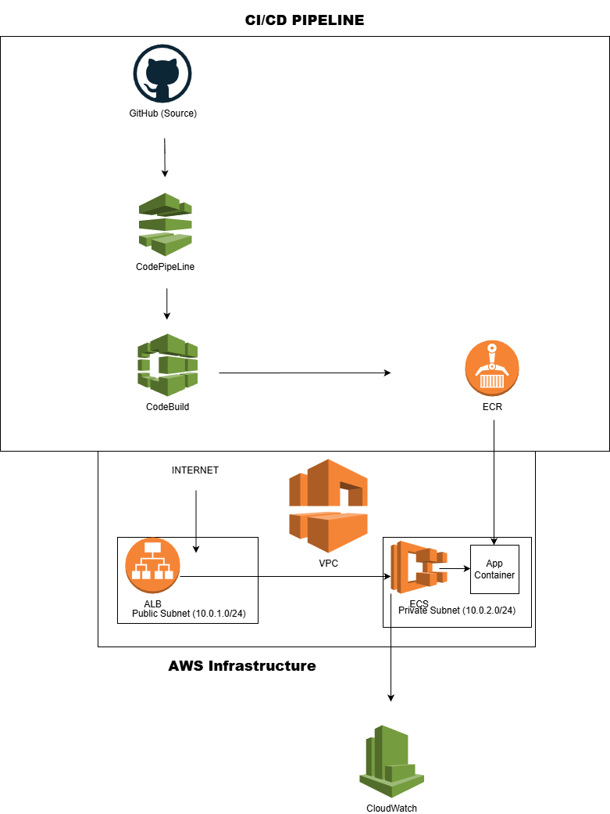

# 👋 Gershon Zormelo — Cloud & DevOps Engineer

🚀 I design, build, and automate secure, scalable cloud infrastructure on AWS using Infrastructure as Code and CI/CD pipelines.  

💡 Hands-on experience deploying containerized applications with ECS, automating delivery pipelines with CodePipeline & CodeBuild, and implementing monitoring with CloudWatch.  

🎯 Focused on building production-ready, highly available, and cost-efficient systems.

---

## ⚡ Core Skills

- ☁️ **Cloud:** AWS (EC2, S3, VPC, IAM, CloudWatch, CloudFront, ECS)
- 🏗 **IaC:** Terraform (modules, workspaces), CloudFormation (basics)
- 🐳 **Containers:** Docker, Amazon ECS/ECR
- 🔄 **CI/CD:** GitHub Actions, AWS CodePipeline & CodeBuild
- 🔐 **Networking/Security:** VPC design, Security Groups, IAM least privilege
- 🔧 **Version Control:** Git & GitHub (branching, PR workflows)

---

## 🚀 Featured Projects

### 🌐 Terraform AWS VPC
**Provisioned a production-ready VPC with public/private subnets**

- Created modular Terraform architecture
- Configured NAT Gateway, Route Tables, and Flow Logs
- Implemented reusable variables and outputs

🔗 https://github.com/GershonzDevOps/terraform-collabcluster

---

### ⚙️ AWS CI/CD Pipeline
**Automated deployment pipeline from GitHub to ECS**

- Built CI/CD using CodePipeline & CodeBuild
- Integrated GitHub as source
- Automated container deployment to ECS

### 🔄 How It Works

1. Code is pushed to GitHub
2. CodePipeline triggers automatically
3. CodeBuild builds Docker image
4. Image is pushed to ECR
5. ECS pulls image and deploys container
6. ALB routes traffic to ECS
7. CloudWatch monitors logs and metrics

### 🛠️ Tools & Services Used

- AWS CodePipeline
- AWS CodeBuild
- Amazon ECR
- Amazon ECS (Fargate)
- Application Load Balancer (ALB)
- Amazon CloudWatch
- Docker
- GitHub

🔗 https://github.com/GershonzDevOps/aws-ci-cd-pipeline

---

### 🐳 Dockerized Web App on ECS
**Deployed scalable containerized application on AWS**

- Built Docker image and pushed to ECR
- Created ECS cluster, task definitions & services
- Configured CloudWatch logs and monitoring

🔗 https://github.com/GershonzDevOps/ecs-docker-app

---

## 📊 Recent Highlights

- ✅ Built reusable Terraform modules for AWS infrastructure
- ✅ Implemented CloudWatch alarms + SNS alerts for monitoring
- ✅ Designed CI/CD pipelines with automated deployments
- ✅ Applied cost optimization (S3 lifecycle, right-sizing)

---

## 🔬 Currently Exploring

- ⚙️ Kubernetes (EKS), Helm, ArgoCD
- 📊 Observability (OpenTelemetry, metrics & tracing)
- 🔐 Secrets management (Vault, AWS SSM)

---

## 📫 Contact Me

- 📧 Email: setor274@gmail.com  
- 🔗 LinkedIn: https://www.linkedin.com/in/gershon-zormelo-479026316  
- 💻 GitHub: https://github.com/GershonzDevOps
